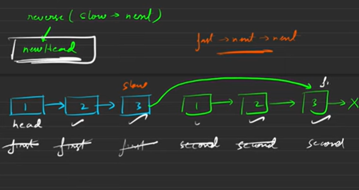

Either do it using a Stack
stack st
Using operations like push() , top() and pop()

Optimal approach ie Tortoise & Hare approach

When we process an even linked list we stop the fast pointer
at the SECOND LAST position. ie fast->next->next
For an odd liinked list we stop at the LAST position.
fast->next

