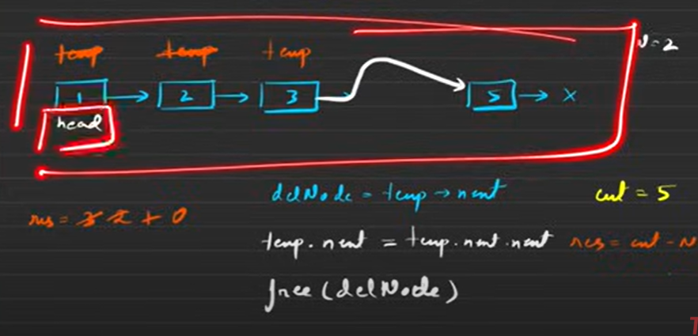

## Brute Force
initialize a counter to get length \
then SUB given n from length \
then proceed
> count - n



The video you referred to is about removing the Nth node from the end of a linked list using multiple approaches. Based on this, here’s a brute-force approach in C++:

### **Brute Force Approach (Two Pass Solution)**
1. **Traverse the Linked List** to find its length.
2. **Traverse Again** until you reach the (N-1)th node and remove the Nth node.


ListNode* removeNthFromEnd(ListNode* head, int n) {
    if (!head) return nullptr;
    
    // Step 1: Calculate the length of linked list
    int length = 0;
    ListNode* temp = head;
    while (temp) {
        length++;
        temp = temp->next;
    }
    
    // Step 2: Find the node to delete
    int target = length - n;
    
    // If we need to remove the first node
    if (target == 0) return head->next;
    
    // Traverse again to find the (target-1)th node
    temp = head;
    for (int i = 0; i < target - 1; i++) {
        temp = temp->next;
    }
    
    // Step 3: Remove the Nth node
    temp->next = temp->next->next;
    
    return head;
}

// Function to print Linked List
void printList(ListNode* head) {
    while (head) {
        cout << head->val << " -> ";
        head = head->next;
    }
    cout << "NULL" << endl;
}

int main() {
    // Sample Linked List: 1 -> 2 -> 3 -> 4 -> 5
    ListNode* head = new ListNode(1);
    head->next = new ListNode(2);
    head->next->next = new ListNode(3);
    head->next->next->next = new ListNode(4);
    head->next->next->next->next = new ListNode(5);

    int n = 2;  // Removing 2nd node from end
    head = removeNthFromEnd(head, n);
    
    printList(head);

    return 0;
}
```

### **Complexity Analysis:**
- **Time Complexity**: O(2L) → Two passes through the list (L is length of the linked list).
- **Space Complexity**: O(1) → No extra space used.

Let me know if you need an optimized approach or any modifications! 🚀