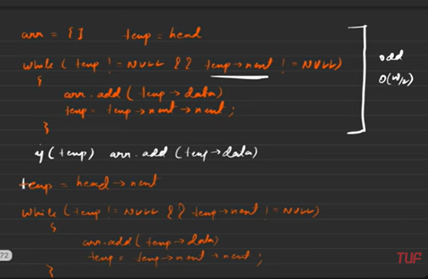
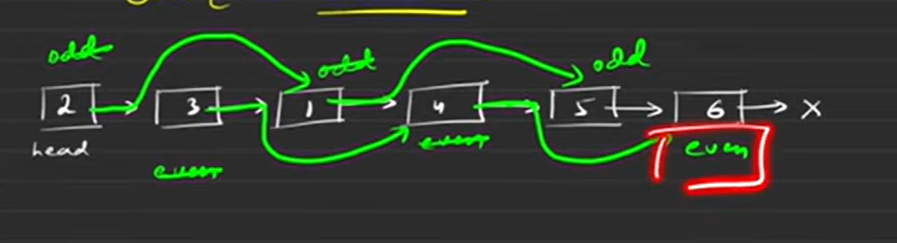
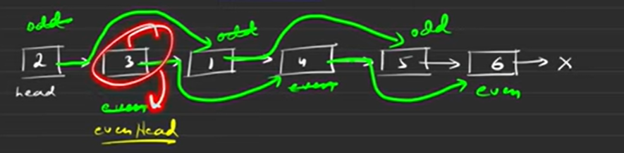

## Brute Force approach


## Optimal Approach

> Check the end of Linked List using even ptr



> Presence of evenHead to point the last end of 
> odd linked list to the start of even linked list 
> so we memoize this ahead of time
> and we write \
> odd -> next = evenHead

This function `oddEvenList` is designed to **reorder a singly linked list** such that all nodes at odd indices are grouped together followed by all nodes at even indices. The indices are based on **1-based indexing**, so:

* `head` (1st node) is considered **odd**,
* `head->next` (2nd node) is **even**,
* `head->next->next` (3rd node) is **odd** again,
* and so on.

---

### 🔧 Code Breakdown

```cpp
ListNode* oddEvenList(ListNode* head) {
    if(head == NULL || head->next == NULL) return head;
```

* If the list is empty or has only one node, return it as-is.

```cpp
ListNode* odd = head;
ListNode* even = head->next;
ListNode* evenHead = head->next;
```

* `odd` points to the first (1st) node.
* `even` points to the second (2nd) node.
* `evenHead` saves the start of even-indexed list so we can attach it to the end later.

---

### 🔁 While Loop Logic

```cpp
while(even != NULL && even->next != NULL){
    odd->next = odd->next->next;
    even->next = even->next->next;

    odd = odd->next;
    even = even->next;
}
```

* This loop continues as long as both `even` and `even->next` are not `NULL`.
* It rearranges pointers to skip alternate nodes:

  * `odd->next = odd->next->next;` skips one node, linking to the next odd.
  * `even->next = even->next->next;` does the same for even.
* Then both `odd` and `even` pointers move forward.

---

### 🔚 Final Step

```cpp
odd->next = evenHead;
```

* This connects the end of the odd list to the beginning of the even list.

---

### ✅ Example

For input: `1 -> 2 -> 3 -> 4 -> 5`

* Odds: `1 -> 3 -> 5`
* Evens: `2 -> 4`

Final list: `1 -> 3 -> 5 -> 2 -> 4`

---

### ⏱ Time & Space Complexity

* **Time**: O(n) – each node is visited once.
* **Space**: O(1) – done in-place without extra memory.

Let me know if you want this visualized or dry-run with a specific input.
